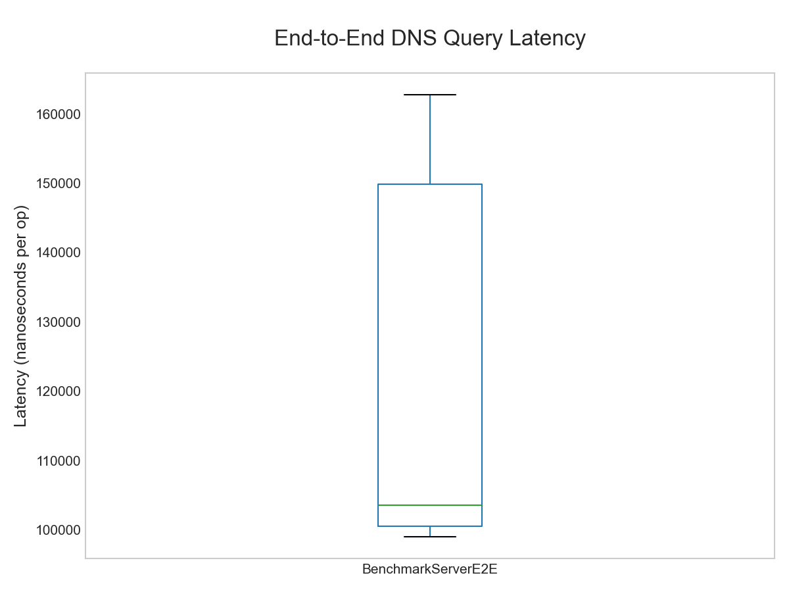
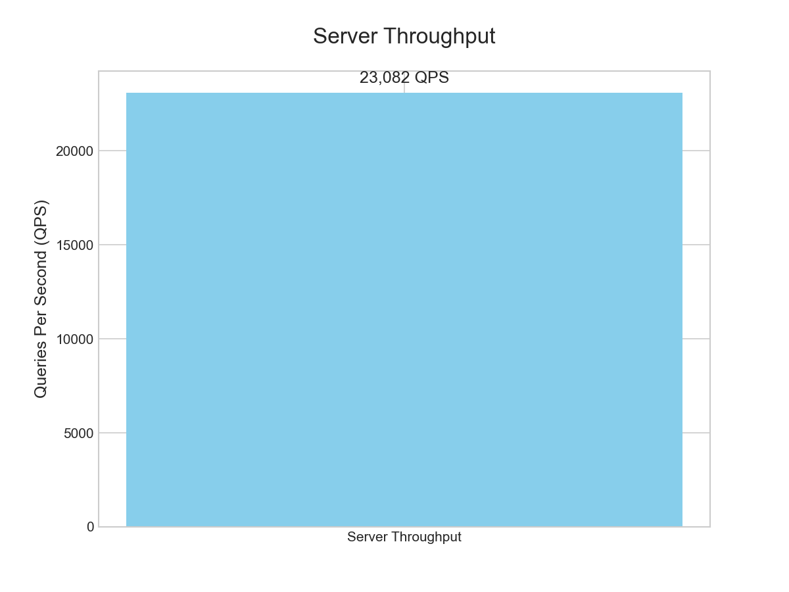

# ⚡ GoDNS - High-Performance DNS Resolver in Go

<p align="center">
  
  
    
### Primary Protocol Documentation
- [RFC 1035: DNS Implementation and Specification](https://datatracker.ietf.org/doc/html/rfc1035)
- [RFC 6891: Extension Mechanisms for DNS (EDNS(0))](https://datatracker.ietf.org/doc/html/rfc6891)

GoDNS is a DNS resolver built from scratch in Go, designed to be RFC 1035 compliant. This project demonstrates core networking concepts by implementing the DNS protocol, featuring a concurrent, non-blocking architecture, and a comprehensive test suite with performance benchmarks.

## ✨ Key Features

* **RFC 1035 Compliant:** Correctly parses and serializes DNS messages, including headers, questions, and resource records.
* **Concurrent by Design:** Uses goroutines to handle multiple incoming queries simultaneously without blocking, maximizing CPU utilization.
* **DNS Message Compression:** Implements label compression and decompression with pointer support to reduce message size, a key feature of the DNS protocol.
* **Built-in Forwarder:** Forwards queries it can't resolve to an upstream resolver (e.g., Google's `8.8.8.8`).
* **Extensively Tested:** Includes unit, integration, and performance benchmark tests to ensure correctness and efficiency.

---


## 🚀 Performance Analysis

The server was benchmarked to measure its two key performance indicators: **latency** (speed) and **throughput** (capacity).

**Test Conditions:** These tests were conducted in a controlled local environment (on a single machine) to measure the raw processing power of the application's code, isolating it from real-world network delays. This provides a clear baseline of the server's core efficiency.

#### Query Latency: How *Fast* is a Single Request?

This graph shows the time it takes for a single query to be processed by the server. **Lower numbers are better.** The box plot visualizes the consistency of the server's response time over many runs, with the green line representing the average (median) speed.

<p align="center">
  
  <br>
  <em>This shows that the server consistently responds very quickly, establishing an efficient baseline for a single transaction.</em>
</p>

#### Server Throughput: How *Much* Can It Handle at Once?

This graph shows how many queries the server can handle per second when processing many requests in parallel. **Higher numbers are better.** This demonstrates the effectiveness of the concurrent architecture using Go's goroutines.

<p align="center">
  
  <br>
  <em>The result confirms the server's non-blocking design can effectively scale to handle a high volume of simultaneous queries.</em>
</p>

---

## 🛠️ Getting Started

### Prerequisites

* Go 1.18 or newer

### 1. Clone the Repository

```sh
git clone https://github.com/sumitbhuia/GoDNS.git
cd GoDNS
````

### 2\. Build the Binary

```sh
# The main package is in the root directory
go build -o godns main.go
```

### 3\. Run the Server

The server listens on port 53 by default, which requires root privileges.

```sh
sudo ./godns
```

To run on a non-privileged port (e.g., 5353) for development:

```sh
./godns -addr=":5353"
```

-----

## ✅ Testing

The project includes a comprehensive test suite.

### Run All Tests

This command runs all unit and integration tests.

```sh
go test ./...
```

### Run Benchmarks

This command will run the performance benchmarks and output the results to your console.

```sh
go test -bench=. -benchmem ./...
```

-----

## How It Works

GoDNS listens for incoming DNS queries over UDP. When a query is received, a new goroutine is spawned to handle it, ensuring the server remains responsive.

1.  **Parsing:** The raw byte query is parsed into a Go struct according to RFC 1035 specifications. This includes decoding the domain name, which may use pointer-based compression.
2.  **Forwarding:** The query is then packed back into its binary format and forwarded to an upstream DNS resolver (e.g., `8.8.8.8`).
3.  **Responding:** When the upstream server responds, GoDNS receives the response and relays it back to the original client, completing the cycle.

<details>
      <summary>More Details - Architecture</summary>
    
## Protocol Architecture

### Core Implementation Components
- **UDP Transport Layer**: Non-blocking datagram processing with concurrent goroutine dispatch
- **DNS Protocol Layer**: RFC1035-compliant message encoding/decoding with compression support
- **Resource Record Handler**: Polymorphic RR type processing with binary-safe implementations
- **Query Propagation**: Asynchronous upstream resolver integration with timeout semantics

### Protocol Specifications
```go
type DNSHeader struct {
    ID      uint16 // Transaction identifier
    Flags   uint16 // Control flags (QR|Opcode|AA|TC|RD|RA|Z|RCODE)
    QDCount uint16 // Question section cardinality
    ANCount uint16 // Answer section RR count
    NSCount uint16 // Authority section RR count
    ARCount uint16 // Additional section RR count
}

type DNSQuestion struct {
    Name  string  // Domain name sequence
    Type  uint16  // RR type identifier
    Class uint16  // Class identifier
}

type DNSRecord struct {
    Name     string  // Domain name sequence
    Type     uint16  // RR type identifier
    Class    uint16  // Class identifier
    TTL      uint32  // Time-to-live
    RDLength uint16  // RDATA length
    RData    []byte  // Resource data
}
```

## Implementation Architecture

### Protocol Processing Pipeline

#### Message Parser Implementation
- Binary-safe buffer management for DNS wire format
- Domain name label compression/decompression with pointer traversal
- Resource record serialization with length-prefixed encoding
- Transaction ID correlation for asynchronous responses

#### Network Stack Integration
- UDP socket multiplexing with Go runtime scheduler
- Concurrent query handling via goroutine dispatch
- Configurable upstream resolver interface
- Structured error propagation and logging

### Binary Wire Format Specification

#### DNS Header Structure (96 bits)
| Field      | Bit Offset | Length | Semantic Definition |
|------------|------------|--------|-------------------|
| ID         | 0          | 16     | Query identifier for transaction correlation |
| Flags      | 16         | 16     | Protocol control bits |
| QDCOUNT    | 32         | 16     | Question section cardinality |
| ANCOUNT    | 48         | 16     | Answer section RR count |
| NSCOUNT    | 64         | 16     | Authority section RR count |
| ARCOUNT    | 80         | 16     | Additional section RR count |

#### Message Compression Algorithm
- Label pointer detection with 2-bit discrimination
- Offset-based compression with 14-bit pointer space
- Recursive decompression with cycle detection
- Length-prefixed label encoding

## Implementation Capabilities

### Protocol Features
- RFC1035-compliant message processing
- Concurrent query handling
- Upstream resolver integration
- Error propagation and recovery
- Domain name compression support

### Technical Architecture
- Non-blocking I/O operations
- Concurrent goroutine dispatch
- Binary-safe buffer handling
- Resource lifecycle management

    
</details>


# ☎️ Contact

  * **Email:** `sumitbhuia100@gmail.com`
  * **Twitter:** [@bhuia\_sumit](https://twitter.com/bhuia_sumit)

---
   

